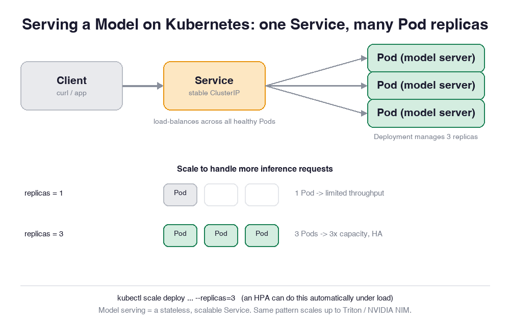

# 📖 Reading: Deploy Your First AI Model on Kubernetes

> Read this first (~4 min), then jump into the hands-on lab. Concept first, practice second.

## 🍽️ Big picture: the recipe and the restaurant

You spent weeks training a model. Right now it's like a **star chef's signature recipe** sitting in a notebook — brilliant, but useless to anyone who can't walk into the kitchen.

**Deploying a model** means opening a *restaurant* around that recipe: anyone can place an order (send data), and a dish comes back (a prediction). The recipe never changes between orders — every order is independent. That single fact is the whole game:

> A model server is a **stateless service**. Give it an input, it returns an output. It remembers nothing between requests.

And "a stateless service that needs to scale" is *exactly* the thing Kubernetes was built to run. So serving a model isn't some exotic ML problem — it's the **most ordinary thing a platform does**, applied to a model container.

**The flow:** `Client -> Service -> [Pod, Pod, Pod]`. One stable front counter (the Service) hands each order to one of several identical line cooks (the Pods).

---

## Now each component, from its own point of view 👇

### 📦 "I am the Pod"
I'm the smallest unit that actually *runs*. Inside me is your **model-server container** — the recipe, loaded and ready. When an order reaches me, I produce a prediction. I am **disposable**: if I crash, Kubernetes throws me away and starts a fresh copy. Don't store anything important inside me — I won't be here tomorrow.

### 🗂️ "I am the Deployment"
I'm the *manager* who keeps Pods alive. You tell me **"I want 3 of these running"** and I make it true — and keep it true. A Pod dies? I start another. You want a new model version? I roll Pods over one at a time with zero downtime. You never hand-start a Pod in production; you tell **me** the desired state and I converge to it. The Pod is the cook; I'm the shift manager who guarantees the right number of cooks are always on the line.

### 🔢 "I am replicas"
I'm just a number on the Deployment — but a powerful one. `replicas: 1` means one cook, so orders queue up behind each other. `replicas: 3` means three identical cooks working in parallel: **up to ~3x the throughput** (near-linear while each replica is the bottleneck — real scaling is a bit sub-linear once a shared resource or the load-balancer kicks in) and, if one falls over, the other two keep serving (high availability). More load? Raise me.

### 🚪 "I am the Service"
Pods come and go, and each gets a *different* IP every time it restarts. If clients had to track those, serving would be chaos. So I am the **one stable address** — a fixed ClusterIP and DNS name — that never changes. Clients only ever talk to me, and I **load-balance** each request across whichever Pods are healthy right now. I'm the front counter; the customer never needs to know which cook made their dish.

### ✅ "I am the readiness probe"
A new Pod isn't useful the instant it starts — the container may still be loading the model into memory. I'm the check that lets a Pod say **"I'm ready to take orders."** Until I pass, the Service refuses to send traffic to that Pod. This is how scaling and rolling updates stay safe: no request is ever routed to a cook who hasn't finished prepping.

---

## 🧠 Why this pattern is the whole job

Every serious model-serving stack is **this same shape**, just with a heavier container in the Pod:

- A tiny CPU echo server (this lab) — proves the pattern.
- **NVIDIA Triton Inference Server** — batches requests, runs multiple models on a GPU.
- **NVIDIA NIM** — pre-packaged, optimized model microservices.

Swap the image, keep the **Deployment + Service + replicas** skeleton. Learn the skeleton once and you can serve anything. (A real GPU model server adds a few things on top of the same skeleton — a `resources: {limits: {nvidia.com/gpu: 1}}` request, the GPU device plugin, a model-weights volume, and far more memory — but the Deployment/Service/replicas shape you're learning here doesn't change.)

## 📈 Scaling: manual today, automatic tomorrow

In this lab you'll scale by hand (`kubectl scale ... --replicas=3`). In production you'd attach a **Horizontal Pod Autoscaler (HPA)**: it watches a metric (CPU, GPU utilization, or request latency) and adds or removes replicas on its own as traffic rises and falls — so you pay for capacity only when you need it.

> 💡 Deployments, Pods, Services, replicas, and autoscaling all appear on the **Kubernetes (CKAD/CKA)** exams and the **NVIDIA NCA-AIIO** certification (AI Operations & Infrastructure domains).

---

**Got the concept? Move on to the hands-on lab and serve a real model yourself.** 🚀
