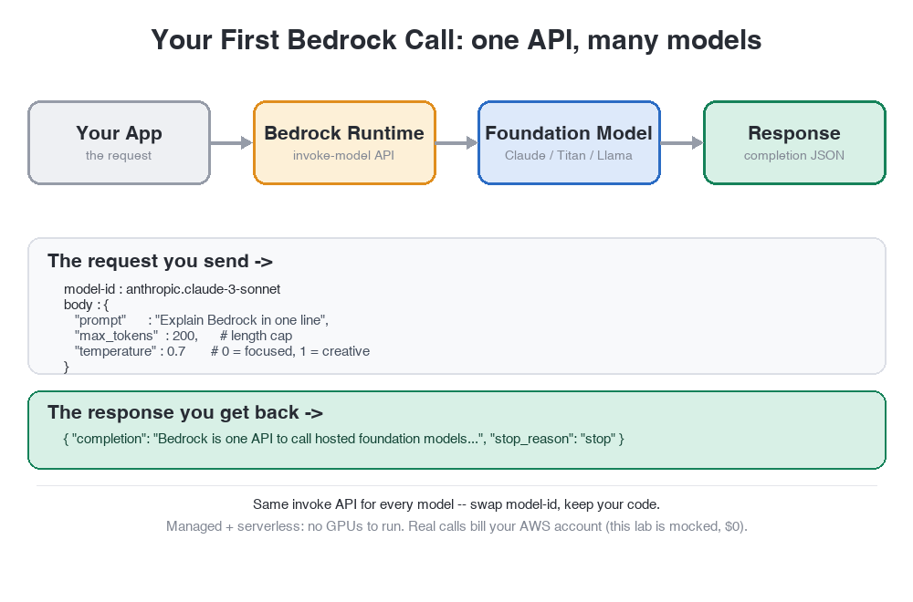

# Your First Bedrock Call ☎️

You're an **Applied AI Builder**. The team wants to add an AI feature, and the fastest way to ship one is to call a **foundation model** that's already trained and hosted — no GPUs to run, no weights to manage.

On AWS, the front door for that is **Amazon Bedrock**: one API to call models from Anthropic (Claude), Amazon (Titan), Meta (Llama), and more. Your job today: make your first call, read the response, and tune it.

In this lab you will:
1. **List** the available foundation models and pick one
2. **Invoke** it — build a request body (prompt + parameters) and read the completion
3. **Tune** the call — change a parameter and watch the output change

> 🧪 **Note:** this lab is **fully simulated** with a mock `aws` CLI — **no AWS account, no network, no cost.** The **CLI commands are real**; the request/response **body is a simplified teaching shape** (each real model differs — Claude uses a messages format, Titan uses `inputText`), so the CLI muscle memory transfers to production.

Click **START** to begin.
