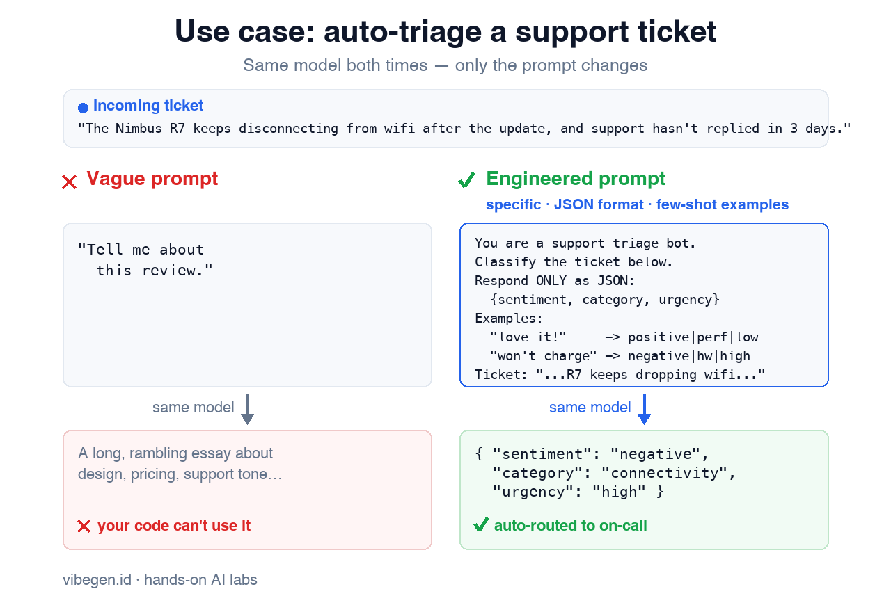

# Prompt Engineering 🧑‍💻

You're an **Applied AI Builder**. You've got a fixed, hosted language model behind an API — you can't retrain it. The only lever you fully control is the **prompt**. Today you'll prove how much that lever is worth.

Your task: take **one** customer review and get the model to produce a **reliable, structured, machine-usable answer** — by improving only the prompt, never the model.

In this lab you will:
1. **Be specific** — watch a vague prompt ramble, then get a tight answer by asking precisely
2. **Force the format** — make the model return clean JSON your code can parse
3. **Show, don't tell** — use a few examples (few-shot) to lock the output format every time

> 🧪 **Note:** this lab is **fully simulated** with a mock `ask` CLI — **no API key, no network, no cost.** It's the *same fixed model* on every call; only your **prompt** changes the output. The techniques (specificity, structured output, few-shot) are exactly what you'd use against a real model like Claude on Bedrock.

Click **START** to begin.
