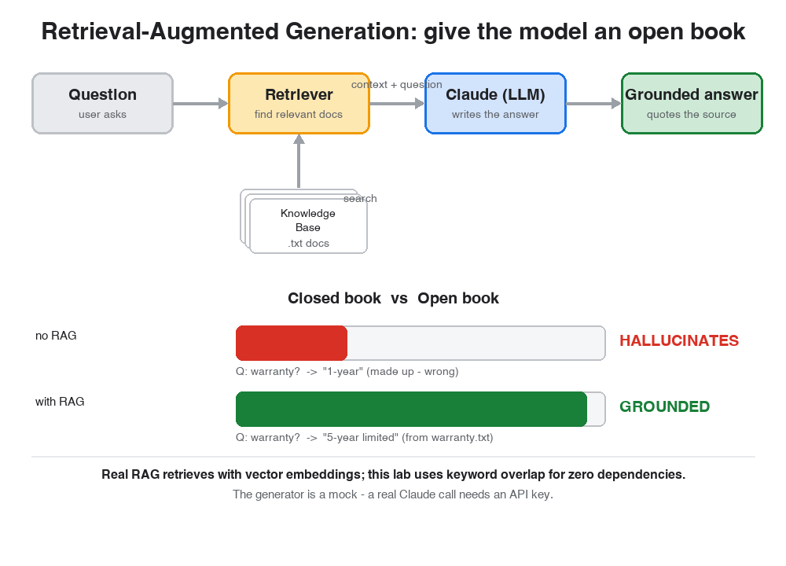

# 📖 Reading: RAG in 15 Minutes with Claude

> Read this first (~4 min), then jump into the hands-on lab. Concept first, practice second.

## 📚 Big picture: the closed-book vs open-book exam

Picture two students taking the same exam.

The first sits a **closed-book exam**. Asked a question about a company they've never studied, they can't say "I don't know" without losing marks — so they write down something *plausible*. It sounds confident. It is wrong. That's a **large language model answering from memory alone**: when it doesn't know, it doesn't go quiet, it **makes something up**. We call that a **hallucination**.

The second student sits an **open-book exam**. Same question — but first they flip to the right page, find the exact fact, and quote it. Their answer is correct *because it's grounded in a source they were handed.*

**Retrieval-Augmented Generation (RAG) turns the closed-book LLM into the open-book one.** Before the model answers, a **retriever** finds the most relevant documents and hands them to the model as context. The model then answers from what's in front of it instead of from a fuzzy memory.

**The flow:** `Question -> Retriever -> [Knowledge Base] -> context + question -> LLM -> grounded answer`. RAG is the whole pipeline, not just the model.

---

## Now each component, from its own point of view 👇

### 🙋 "I am the Question"
I'm what the user actually wants to know — *"what is the warranty on the Nimbus R7?"*. On my own I'm just text. What happens next depends entirely on whether anyone bothers to look up the answer before the model speaks.

### 🔎 "I am the Retriever"
My job is to read the question and pull the **most relevant documents** out of the knowledge base. In real systems I turn text into **vector embeddings** — numeric fingerprints of meaning — and find the documents whose fingerprints sit closest to the question's. In *this* lab I do something simpler that teaches the same instinct: I score documents by **keyword overlap**, weighting rare, meaningful words (`warranty`, `battery`) and ignoring words that appear in every document (`Nimbus`, `R7`). Either way, my output is the same: a short stack of context for the model to read.

### 🧠 "I am the LLM (Claude)"
I write the answer. Hand me **nothing** and I answer from my training — which, for a company I was never trained on, means a confident guess. Hand me the **retrieved context** and I do something far more reliable: I read it and quote the fact. Same model, same question — the *context* is what changes my answer from invented to grounded.

### 🗄️ "I am the Knowledge Base"
I'm the set of documents that hold the truth the model doesn't have — product specs, policies, internal docs, last week's tickets. **I am the ceiling on what RAG can answer.** If a fact isn't written in me, no retriever can find it and no amount of RAG will conjure it.

---

## ⚠️ One caveat before you trust the output
RAG **reduces** hallucination — it doesn't abolish it. The answer is only as good as **what's in the corpus** and **how well the retriever finds it.** Two ways it still breaks:

- **The fact isn't in the knowledge base.** A good RAG setup should then say *"I don't know"* — but a careless one will fall back to guessing anyway. You'll see both behaviors in Step 3.
- **The retriever pulls the wrong document.** If retrieval surfaces an irrelevant passage, the model grounds its answer in the *wrong* fact and sounds just as confident. **Retrieval quality is most of the battle** — which is why real systems invest in embeddings, chunking, and re-ranking.

## 🔍 How RAG works (the core skill)
1. **Index** your documents into a searchable store (real systems: a vector database of embeddings; this lab: plain text files).
2. **Retrieve** the top-k most relevant documents for the question.
3. **Augment** the prompt — stitch the retrieved context together with the question.
4. **Generate** — the LLM answers *from the supplied context*, ideally citing its source.

## 🔌 Embeddings vs keywords, and the real Claude call
This lab uses **keyword retrieval** so it runs with zero dependencies and no API key. Production systems use **vector embeddings**, which match on *meaning* ("how long does the charge last?" finds a doc about "battery life") rather than exact words. And the generator here is a **mock** — a real deployment swaps it for an actual Claude API call (`client.messages.create(...)`), which needs an `ANTHROPIC_API_KEY`. The *architecture* you build here is exactly the real one; only those two pieces get upgraded.

## 💰 Why this matters
Grounding an LLM in your own documents is how you turn a general model into one that answers correctly about **your** product, policies, and data — without retraining it. It's the backbone of support bots, internal search, and "chat with your docs." Building this loop is a core skill on the **Applied AI Builder** track.

---

**Got the concept? Move on to the hands-on lab and prove it yourself.** 🚀
