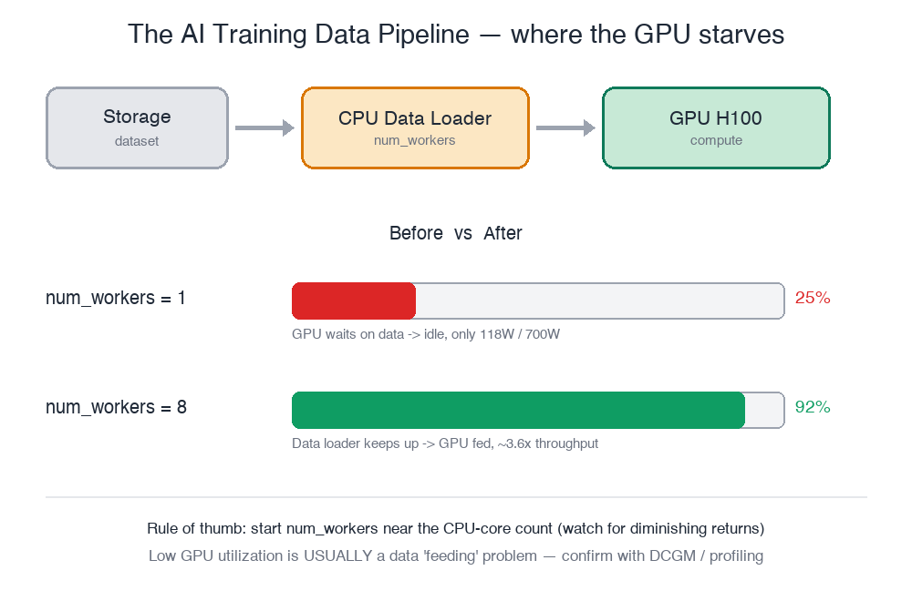

# The Starving GPU 🍽️

You're an **AI Infrastructure Engineer**. Today the data science team reports their ResNet training job is "really slow" — even though it runs on an **NVIDIA H100**, a GPU worth hundreds of thousands of dollars.

A GPU that expensive **must never sit idle**. Your job: find out why, then fix it.

In this lab you will:
1. Read the GPU status and spot the symptom
2. Trace the root cause through logs & config
3. Fix the pipeline and prove the GPU is "fed"

> ⚙️ **Note:** this lab is fully simulated on a plain Linux box — no physical GPU required. But the diagnostic flow is exactly the same as in production.

Click **START** to begin.
