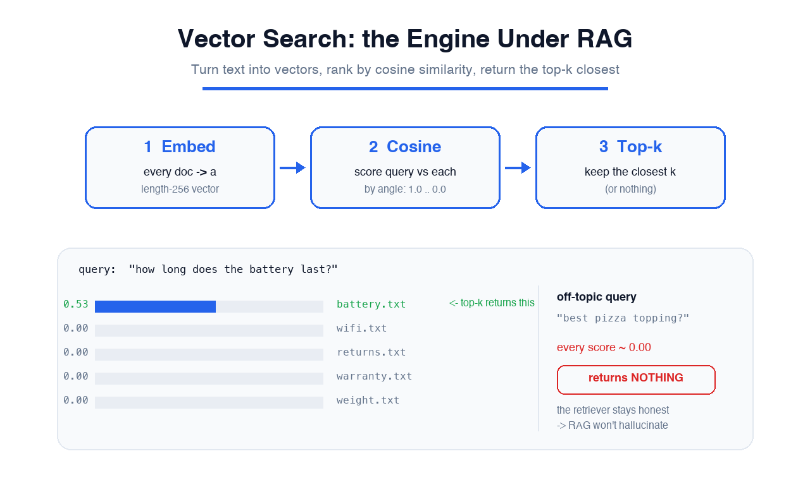

# 📖 Reading: Vector Search — the Engine Under RAG

> Read this first (~4 min), then jump into the hands-on lab. Concept first, practice second.

## 🧭 Big picture: finding the nearest neighbor by meaning

In the RAG lab, a **retriever** quietly handed the model the right document before it answered. We treated that retriever as a black box. **This lab opens the box.**

The problem it solves sounds simple: *given a question, which of my documents is most relevant?* A keyword search (`grep`) only finds documents that use the **same words** as the question. Ask *"how long does the charge last?"* and a doc titled *"battery life: 18 hours"* never matches — no shared words, even though it's the perfect answer.

**Vector search fixes this by comparing meaning instead of letters.** The trick is to turn every piece of text into a **vector** — a list of numbers, a point in space — positioned so that *texts about similar things land close together*. Then "find the most relevant document" becomes a geometry question: **which document's point is closest to the question's point?**

> Embeddings turn *meaning* into *coordinates*. Once text is coordinates, "relevance" is just "distance."

---

## Now each piece, from its own point of view 👇

### 🔤 "I am the Embedder"
I turn text into a fixed-length vector — its **embedding**. A real embedder is a trained neural network, and it places *"battery life"* near *"how long does the charge last"* even though they share no words, because it learned what they **mean**. In *this* lab I'm a stand-in: I split text into words and drop each into a numbered bucket (a **hashed bag-of-words** vector). My version matches on shared *words*, not deep meaning — but the machinery is identical: text in, a same-shaped vector out, every time.

### 📐 "I am Cosine Similarity"
I measure how close two vectors are by the **angle** between them, not their length. I return a single number: **1.0** means they point the exact same way (identical meaning), **0.0** means they're unrelated (perpendicular). I use the angle, not raw distance, so a long document and a short query can still score as a perfect match. Score every document against the question with me, and the highest score is the best match.

### 🏆 "I am Top-k"
I'm the last step. Once every document has a similarity score, I sort them and return the **k** highest — `top_k=1` for the single best, `top_k=3` to hand the model a few candidates. I'm also the honest one: if *every* score is near zero, the right answer is to return **nothing**. A retriever that invents a match for an off-topic query is what makes RAG ground its answer in the wrong document.

---

## 🔗 How the three fit together (the core skill)
1. **Embed** every document once, ahead of time, and store the vectors (a real system uses a **vector database**).
2. **Embed the query** the same way when a question comes in.
3. **Score** the query vector against every document vector with cosine similarity.
4. **Return top-k** — the closest documents. That's the retrieval result RAG feeds to the model.

That's the whole retriever. `Embeddings -> cosine similarity -> top-k` is the loop you'll build by hand in the next 15 minutes.

---

## ⚠️ Two things to keep honest
- **Your embedder is the ceiling.** Real systems use a trained model so *"charge"* finds *"battery"*. The lab's word-overlap version is simpler on purpose — same shape, same math, easier to see. Swapping in a real model is the one upgrade between this and production.
- **Off-topic must return nothing.** If a query has no good match, a good retriever says so instead of returning its least-bad guess. You'll prove this in Step 3 — and it's exactly the behavior that stops RAG from hallucinating off an irrelevant document.

## 💰 Why this matters
Every "chat with your docs," semantic search bar, and RAG pipeline runs on this exact loop. The model gets the headlines, but **retrieval quality is most of what makes the answer right.** Engineers who understand embeddings and cosine similarity — instead of treating retrieval as magic — are the ones who can actually debug and tune a RAG system.

> 💡 Embeddings, vector similarity, and semantic search show up on applied-AI certs like the **AWS Certified AI Practitioner** and **NVIDIA NCA-AIIO** (Essential AI Knowledge).

---

**Got the idea? Open the lab and build the retriever that RAG treats as a black box.** 🚀
